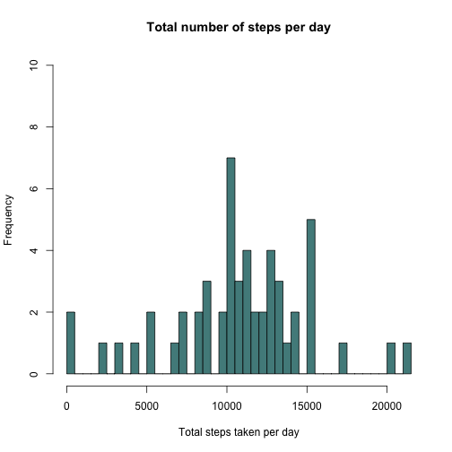
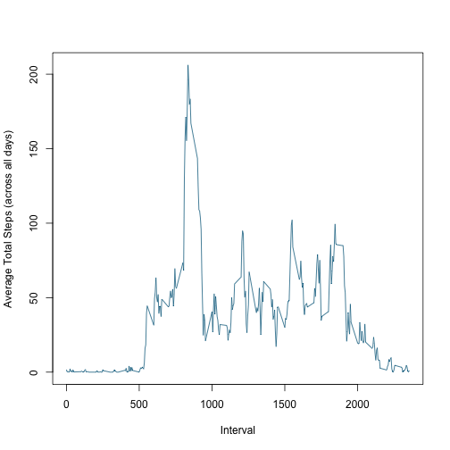
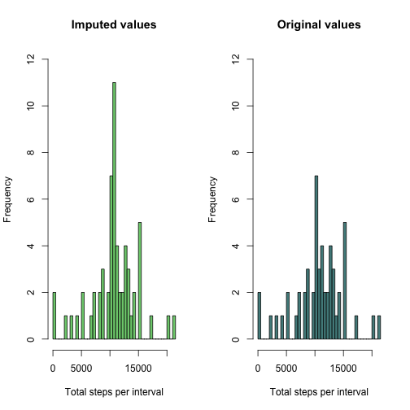
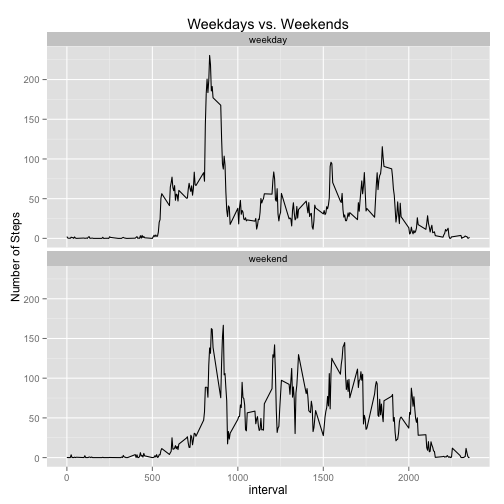

Coursera Reproducible Research Peer Assessment_1  
================================================   

###Loading Activity monitoring data [52K]:  


```r
act <- read.csv("activity.csv")
```

Load appropriate libraries

```r
library(plyr)
library(dplyr)
```

```
## 
## Attaching package: 'dplyr'
## 
## The following objects are masked from 'package:plyr':
## 
##     arrange, count, desc, failwith, id, mutate, rename, summarise,
##     summarize
## 
## The following object is masked from 'package:stats':
## 
##     filter
## 
## The following objects are masked from 'package:base':
## 
##     intersect, setdiff, setequal, union
```
###Pre-processing the data 

```r
# convert to tbl class
act <- tbl_df(act)
# convert date column to Date format
act$date <- as.Date(as.character(act$date))
```

###What is mean total number of steps taken per day? 

1. Calculate the total number of steps taken per day


```r
# group by date and summarize by total number of steps
totals <- act %>% group_by(date) %>% summarise(total=sum(steps))
```

2. Make a histogram of the total number of steps taken each day

```r
# plot histogram of total number of steps taken each day
hist(totals$total, breaks = 61, ylim=c(0,10), 
     main = "Total number of steps per day",
     xlab = "Total steps taken per day",
     col = "darkslategray4")
```

 

3. Calculate and report the mean and median of the total number of steps taken per day

```r
# calculate and report mean and median of total steps per day
sum <- summary(totals$total)
sum[3:4]
```

```
## Median   Mean 
##  10760  10770
```

###What is the average daily activity pattern?  

1. Make a time series plot of the 5-minute interval (x-axis) and the average number of steps taken, averaged across all days (y-axis)  


```r
# remove na values, group by interval, and summarize by mean steps per day
int <- act %>% filter(!is.na(steps)) %>% group_by(interval) %>% summarise(total=mean(steps))
# plot 5-minute interval by average daily steps across all days
plot(int$interval,int$total, type = "l", col = "deepskyblue4", 
     ylab = "Average Total Steps (across all days)", xlab = "Interval")
```

 

2. Which 5-minute interval, on average across all the days in the dataset, contains the maximum number of steps?  


```r
# which 5-minute interval, on average, contains max steps?
max_int <- int$interval[int$total == max(int$total)]
max_int
```

```
## [1] 835
```

###Imputing missing values  

1. Calculate and report the total number of missing values in the dataset  


```r
# calculate number of missing values
num_na <- summary(act$steps)[7]
num_na
```

```
## NA's 
## 2304
```

Note: All NA values are from entire days with no steps recorded. 
There are no days that have both recorded steps and NA's

```r
nas <- act$date[which(is.na(act$step))]
notnas <- act$date[which(!is.na(act$step))]
```

```r
intersect(nas,notnas)
```

```
## numeric(0)
```

2. Fill in (impute) all of the missing values in the dataset.  


```r
# get dates of NA's
na_dates <- filter(act,is.na(steps))
# create temp data frame from dates of NA's with average steps per interval
imputed_df <- data.frame(steps = rep(int$total,8), date = rep(unique(na_dates$date), each = 288), interval = rep(int$interval,8))
```

3. Create a new dataset that is equal to the original dataset but with the missing data filled in.  


```r
# create new dataset equal to original with imputed NA values
# new data frame from non-NA's in original dataset
new_act <- act %>% filter(!is.na(steps))
# rbind new data frame with imputed data frame
new_act <- rbind(new_act,imputed_df)
```

4. Make a histogram of the total number of steps taken each day and Calculate and report the mean and median total number of steps taken per day. Do these values differ from the estimates from the first part of the assignment?   


```r
# create histogram of total steps taken
new_totals <- new_act %>% group_by(date) %>% summarise(total=sum(steps))
par(mfrow = c(1,2))
hist(new_totals$total, breaks = 61, ylim=c(0,12), col = "palegreen3", 
     main = "Imputed values", xlab = "Total steps per interval")
hist(totals$total, breaks = 61, ylim=c(0,12), col = "darkslategray4", 
     main = "Original values", xlab = "Total steps per interval")
```

 

```r
# calculate and report mean and median of total steps per day
new_sum <- summary(new_totals$total)
new_sum[3:4]
```

```
## Median   Mean 
##  10770  10770
```
What is the impact of imputing missing data on the estimates of the total daily number of steps?  

While the mean in both instances is the same we can see that the median value has changed and is now the same as the mean value. The frequency of the steps taken has stayed the same for all intervals with the exception of the 10.5k to 11k steps bar, which has changed from a frequency of 3 to a frequency of 11. This makes sense because there were 8 days in which no steps were recorded. Our imputed data added 8 days, all with the averange number of steps. 


###Are there differences in activity patterns between weekdays and weekends?  

1. Create a new factor variable in the dataset with two levels – “weekday” and “weekend” indicating whether a given date is a weekday or weekend day.  


```r
new_act <- new_act %>% mutate(days = ifelse(weekdays(date) %in% c("Saturday","Sunday"), "weekend","weekday"))
new_act$days <- as.factor(new_act$days)
```

Structure of with new factor variable:  

```
## Classes 'tbl_df', 'tbl' and 'data.frame':	17568 obs. of  4 variables:
##  $ steps   : num  0 0 0 0 0 0 0 0 0 0 ...
##  $ date    : Date, format: "2012-10-02" "2012-10-02" ...
##  $ interval: int  0 5 10 15 20 25 30 35 40 45 ...
##  $ days    : Factor w/ 2 levels "weekday","weekend": 1 1 1 1 1 1 1 1 1 1 ...
```

2. Make a panel plot containing a time series plot (i.e. type = "l") of the 5-minute interval (x-axis) and the average number of steps taken, averaged across all weekday days or weekend days (y-axis).  

Load appropriate libraries for plots

```r
library(ggplot2)
library(scales)
```


```r
new_int <- new_act %>%  group_by(days,interval) %>% summarise(total=mean(steps))
g <- ggplot(new_int, aes(interval,total))
g + geom_line() + 
        facet_wrap(~ days, nrow=2, ncol=1) + 
        labs(y = "Number of Steps") + 
        labs(title = "Weekdays vs. Weekends")
```

 
